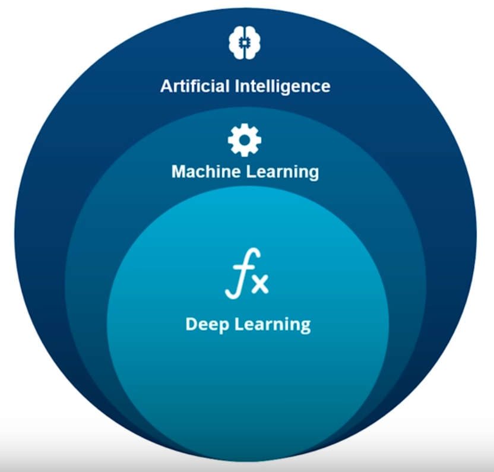
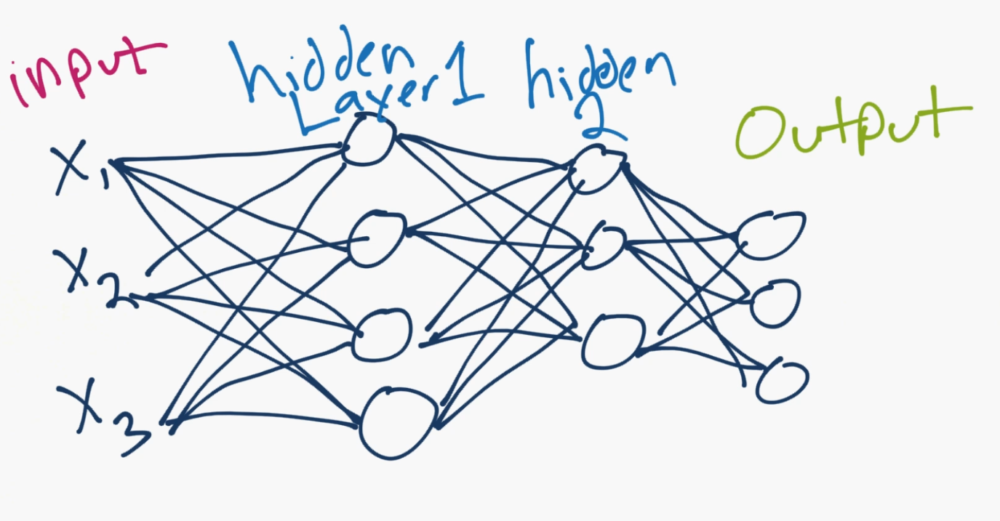
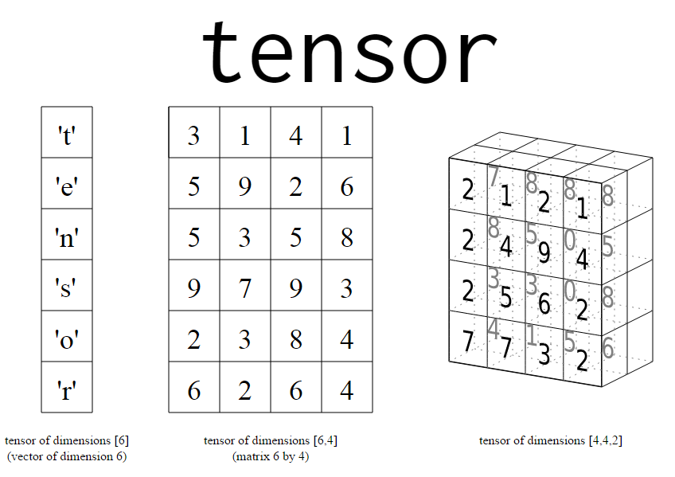
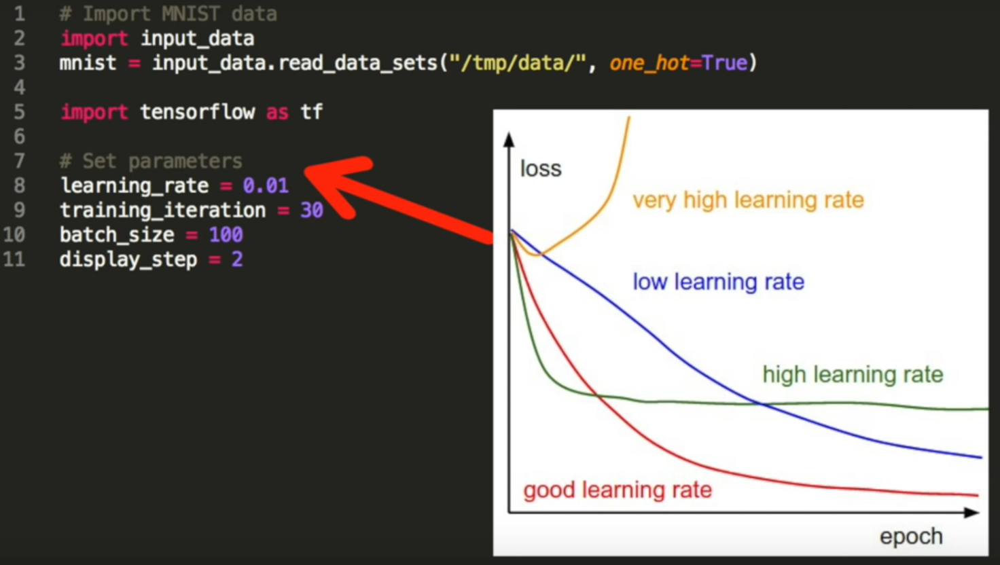
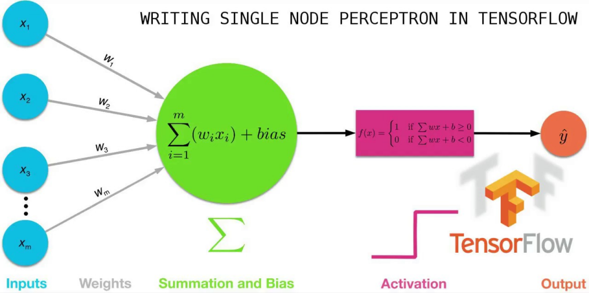

# 🐍 AI Deep Learning TensorFlow Python 🐍
🐍 **Deep Learning** with **TensorFlow** 🐍

Learning & Understanding **Deep Learning / Machine Learning / Artificial Intelligence (AI)**.</br>
I tried to keep it as short as possible, but Truth needs to be told, **Deep Learning / Machine Learning and Artificial Intelligence (AI)** are big topics. </br>
In this Repository, the focus is mainly on **TensorFlow** and **Deep Learning** with **neural networks**.

<p align="center">
  
</p>

## What is a neural network? 🌐

A basic **neural network** consists of an **input layer**, which is just **your data, in numerical form**. After your **input layer**, you will have some number of what are called **"hidden" layers**. **A hidden layer** is just in between your input and output layers.</br> ***One hidden layer means you just have a neural network. Two or more hidden layers? you've got a deep neural network!***



## What is a Tensor? 🔢

Each operation takes a **Tensor** as an Input and outputs a **Tensor**.</br>
A **Tensor** is how Data is represented in **TensorFlow**.</br>
A **Tensor is a multidimensional array** ex: </br>
([0.245,0.618,0.382], </br>[0.618,0.382,0.245], </br>[0.382,0.245,0.618]). </br>
This would be a **normalized three-way-tensor**.</br>
**normalized** in **TensorFlow** means that the numbers are converted to a value between 0 and 1.</br> The Data needs to be **normalized**, to be actually useable in **TensorFlow**.



## Hyper Parameters 🔡

**Hyperparameters** contain the data that govern the training process itself. </br>

As an ex. if the **learning rate** is too big, our model may skip the optimal solution, if the **learning rate** is too small we may need to many iterations to get the best result, so we try to find a **learning rate** that fits for our purpose.



## What are Weights and Biases? 🔤

**Weights** and **Biases** are the **learnable parameters of your model**. As well as **neural networks**, they appear with the same names in related models such as linear regression. Most machine learning algorithms include some **learnable parameters** like this.



## 📝 Example Code with Comments 📝
```
import tensorflow as tf  # deep learning library. Tensors are just multi-dimensional arrays

mnist = tf.keras.datasets.mnist  # mnist is a dataset of 28x28 images of handwritten digits and their labels
(x_train, y_train),(x_test, y_test) = mnist.load_data()  # unpacks images to x_train/x_test and labels to y_train/y_test

x_train = tf.keras.utils.normalize(x_train, axis=1)  # scales data between 0 and 1
x_test = tf.keras.utils.normalize(x_test, axis=1)  # scales data between 0 and 1

model = tf.keras.models.Sequential()  # a basic feed-forward model
model.add(tf.keras.layers.Flatten())  # takes our 28x28 and makes it 1x784
model.add(tf.keras.layers.Dense(128, activation=tf.nn.relu))  # a simple fully-connected layer, 128 units, relu activation
model.add(tf.keras.layers.Dense(128, activation=tf.nn.relu))  # a simple fully-connected layer, 128 units, relu activation
model.add(tf.keras.layers.Dense(10, activation=tf.nn.softmax))  # our output layer. 10 units for 10 classes. Softmax for probability distribution

model.compile(optimizer='adam',  # Good default optimizer to start with
              loss='sparse_categorical_crossentropy',  # how will we calculate our "error." Neural network aims to minimize loss.
              metrics=['accuracy'])  # what to track

model.fit(x_train, y_train, epochs=3)  # train the model

val_loss, val_acc = model.evaluate(x_test, y_test)  # evaluate the out of sample data with model
print(val_loss)  # model's loss (error)
print(val_acc) # model's accuracy
```
## Resources & Links: ⛓
https://www.tensorflow.org/ </br>
https://ai.google/education/ </br>
Deep Learning: https://pythonprogramming.net/introduction-deep-learning-python-tensorflow-keras/ </br>
TensorFlow Overview: https://www.youtube.com/watch?v=2FmcHiLCwTU </br>
AI vs Machine Learning vs Deep Learning: https://www.youtube.com/watch?v=WSbgixdC9g8 </br>
https://www.quora.com/What-do-the-terms-Weights-and-Biases-mean-in-Google-TensorFlow </br>
https://datascience.stackexchange.com/questions/19099/what-is-weight-and-bias-in-deep-learning
